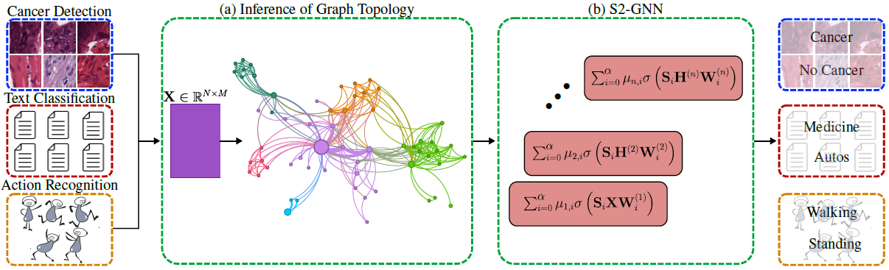

# Higher-Order GNNs Meet Efficiency: Sparse Sobolev Graph Neural Networks (S2-GNN)

This is the repository of the paper "Higher-Order GNNs Meet Efficiency: Sparse Sobolev Graph Neural Networks" published in the IEEE Transactions on Signal and Information Processing over Networks (IEEE T-SIPN).

**Authors:** [Jhony H Giraldo](https://sites.google.com/view/jhonygiraldo), Aref Einizade, Andjela Todorovic, [Jhon A. Castro-Correa](https://www.eecis.udel.edu/~jcastro/), [Mohsen Badiey](https://www.eecis.udel.edu/~badiey/), Thierry Bouwmans, and [Fragkiskos D. Malliaross](https://fragkiskos.me)

## Table of Contents
- [Higher-Order GNNs Meet Efficiency: Sparse Sobolev Graph Neural Networks (S2-GNN)](#higher-order-gnns-meet-efficiency-sparse-sobolev-graph-neural-networks-s2-gnn)
  - [Table of Contents](#table-of-contents)
  - [Abstract](#abstract)
  - [Getting Started](#getting-started)
    - [Create a Virtual Environment](#create-a-virtual-environment)
    - [Clone this Repository](#clone-this-repository)
    - [Prerequisites](#prerequisites)
    - [Run the Code](#run-the-code)
    - [Add a New Model](#add-a-new-model)
  - [Citation](#citation)
  - [Acknowledgements](#acknowledgements)
  - [Contact](#contact)

## Abstract

Graph Neural Networks (GNNs) have shown great promise in modeling relationships between nodes in a graph, but capturing higher-order relationships remains a challenge for large-scale networks. Previous studies have primarily attempted to utilize the information from higher-order neighbors in the graph, involving the incorporation of powers of the shift operator, such as the graph Laplacian or adjacency matrix. This approach comes with a trade-off in terms of increased computational and memory demands. Relying on graph spectral theory, we make a fundamental observation: the regular and the Hadamard power of the Laplacian matrix behave similarly in the spectrum. This observation has significant implications for capturing higher-order information in GNNs for various tasks such as node classification and semi-supervised learning. Consequently, we propose a novel graph convolutional operator based on the sparse Sobolev norm of graph signals. Our approach, known as Sparse Sobolev GNN (S2-GNN), employs Hadamard products between matrices to maintain the sparsity level in graph representations. S2-GNN utilizes a cascade of filters with increasing Hadamard powers to generate a diverse set of functions. We theoretically analyze the stability of S2-GNN to show the robustness of the model against possible graph perturbations. We also conduct a comprehensive evaluation of S2-GNN across various graph mining, semi-supervised node classification, and computer vision tasks. In particular use cases, our algorithm demonstrates competitive performance compared to state-of-the-art GNNs in terms of performance and running time.

---

<div align="center">
    <a href="./">
        
    </a>
</div>

---

## Getting Started

### Create a Virtual Environment

If you have Python's `virtualenv` package installed (through `apt` on Ubuntu), you can make a virtual environment via the following:

```bash
# change your path and name for your virtual env (remove [])
python3 -m virtualenv ~/path/to/virtual/env/storage/[name]

# then source your environment (you need to do this each time you run!)
# again, remove the [] from name
source ~/path/to/virtual/env/storage/[name]
# this should give a nice `([name])` at the beginning of each terminal line
```

### Clone this Repository

```bash
git clone https://github.com/jhonygiraldo/S2-GNN.git  
```

### Prerequisites

Our code requires Python >= 3.10.6

You also need the additional packages listed in the [requirements.txt](./requirements.txt) file. You can install the requirements using:

```bash
pip install -r requirements.txt
```

### Run the Code
With the requirements installed, the scripts are ready to be run and used. To run the hyperparameter optimization code, simply run:

```bash
python3 hyperparam_opt.py -FLAGS [options]
```

To train a model, run:
```bash 
python3 train.py -FLAGS [options]
```

To see all the valid options available for hyperparameter optimization and training, please refer to the parser code in [s2gnn.utils.parser](./s2gnn/utils/parser.py).

Additional companion codes to generate plots, compute results from testing, and run ablation studies in the paper are also provided in the repository.

### Add a New Model
To add a new model, add the corresponding class into the module [s2gnn.nets.models](./s2gnn/nets/models.py).

## Citation
If you use our code, please consider citing our work:

```bash
@article{giraldo2024s2gnn,
  author={Giraldo, Jhony H. and Einizade, Aref and Todorovic, Andjela and Castro-Correa, Jhon A. and Badiey, Mohsen and Bouwmans, Thierry and Malliaros, Fragkiskos D.},
  booktitle={IEEE Transactions on Signal and Information Processing over Networks}, 
  title={Higher-Order GNNs Meet Efficiency: Sparse Sobolev Graph Neural Networks}, 
  year={2024},
  volume={},
  number={},
  pages={},
  keywords={Graph neural networks; sparse graph convolutions; higher-order convolutions; graph spectrum; Sobolev norm},
  publisher={IEEE}
}
```

## Acknowledgements
This work was supported in part by ANR (French National Research Agency) under the JCJC project GraphIA (ANR-20-CE23-0009-01), by the Office of Naval Research ONR (Grant No. N00014-21-1-2760), and by the center Hi! PARIS.

## Contact
For any query, please contact me at: **jhony dot giraldo at telecom-paris dot fr**
